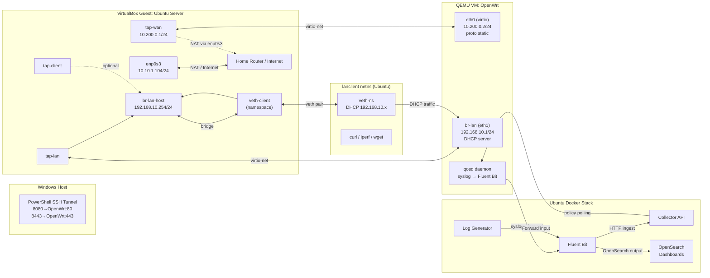

# Network Telemetry Capstone Stack

## Integration of OpenWrt Telemetry with Fluent Bit and OpenSearch

This repository packages an end-to-end observability pipeline for the capstone project on **Network Observability and Telemetry Automation**. The stack bridges OpenWrt edge routers with an Ubuntu logging gateway that runs Fluent Bit, OpenSearch, and OpenSearch Dashboards inside Docker Compose. Runtime profiles target ≤ 512 MB per container for the lightweight services (Fluent Bit, Dashboards, generators); OpenSearch is capped at 768 MB with a tuned JVM heap (320 MB) to keep the node responsive under constrained lab conditions.

## Network topology



### Containers and Data Flow

| Component | Purpose | Key Ports | Notes |
|-----------|---------|-----------|-------|
| `opensearch-node` | Stores and indexes telemetry (`my-app-logs-*`) | `9200`, `9600` | Security plugin disabled for lab repeatability. |
| `opensearch-dashboards` | Visual analytics workspace | `5601` | Pre-configured to trust the local OpenSearch node. |
| `fluent-bit` | Ingestion and enrichment gateway | `24224`, `24224/udp`, `5514/udp`, `2020` | Accepts Fluent Forward streams and legacy syslog, then enriches and forwards to OpenSearch. |
| `collector-api` | Receives Fluent Bit HTTP output, keeps persona telemetry, serves policy endpoints | `4000` | Stateless Node.js service with in-memory policy store; QoSD polls `/policy/<persona>`. |
| `suricata` | DPI engine (GPLv3) identifying application protocols | host network | Emits `eve.json` with `app_proto` fields; collector consumes these to override personas via ubus. |
| `log-generator` | Synthetic workload (can be replaced by OpenWrt) | — | Emits JSON logs for functional tests. |

Each service has a restart policy of `unless-stopped`, integrates with the named Docker network `telemetry_observability`, and enforces memory ceilings (768 MB for OpenSearch, 512 MB for Dashboards/Fluent Bit, 64 MB for the generator). Health checks confirm readiness before dependent services start.

---

## Deployment Guide

1. **Prerequisites**
   - Ubuntu 24.04 LTS with Docker Engine ≥ 27 and Docker Compose plugin.
   - `curl`, `jq`, and `nc` (netcat) for testing.

2. **Start the stack**

   ```bash
   docker-compose pull        # optional, but ensures tagged versions
   docker-compose up -d
   docker-compose ps
   ```

   The `fluent-bit` health check is accessible at http://localhost:2020/.

3. **Stop the stack**

   ```bash
   docker-compose down --volumes
   ```

   The named volume `opensearch-data` shadows OpenSearch indices; delete it only when you must reset the lab.

---

## Fluent Bit Inputs and Parsing

- **Fluent Forward (`:24224` TCP/UDP)**: Primary channel for the Docker logging driver and for OpenWrt routers configured with `forward` output. Messages tagged `app.log.*` inherit telemetry metadata and are parsed as JSON (`docker_json` parser).
- **Syslog (`:5514/udp`)**: Supports legacy forwarding via `/etc/syslog.conf` or BusyBox `syslogd`. The `syslog-rfc3164` parser extracts priority, host, and program fields.
- **Enrichment filters**: The configuration adds `pipeline_stage`, `pipeline_input`, and optionally Docker metadata to each record. This maintains compatibility with QoS / traffic analytics modules that may correlate per-router insights.
- **Dual output**: Records are streamed to OpenSearch and mirrored to the Collector API via Fluent Bit's HTTP output (`collector-api:4000/ingest`). The collector maintains persona stats and exposes policy documents for qosd.
- **Index naming**: `Logstash_Format On` with `Logstash_Prefix my-app-logs` yields daily indices such as `my-app-logs-2025.10.14`, ensuring deterministic naming for dashboards and archival policies.

---

## Collector API Service

The lightweight collector (`collector-api`) closes the loop between Fluent Bit telemetry and policy distribution:

- `POST /ingest` – Fluent Bit HTTP output endpoint. Events are tracked in-memory (most recent 200) and summarised per persona.
- `GET /policy/<persona>` – Returns the effective policy document (priority, DSCP mark, action) for the requested persona.
- `POST /policy` – Allows lab experiments to override persona policies dynamically (`{"persona":"streaming","policy_action":"throttle","priority":"low","dscp":"CS1"}`).
- `GET /telemetry/persona` and `GET /telemetry/recent` – Provide quick inspection endpoints for dashboards or troubleshooting.
- `GET /health` – Simple readiness check used by Docker Compose.

QoSD nodes can poll the policy endpoint periodically (e.g., via cron or an ubus worker) to align local enforcement with collector insights.

---

## Suricata DPI Service

Suricata (GPLv3) runs alongside the collector inside Docker Compose to extract application metadata (e.g., Zoom, Netflix) without burdening the OpenWrt router:

1. **Configuration & Logs**
   - `suricata/config/suricata.yaml` enables EVE app-layer output.
   - Logs are written to `suricata/logs/eve.json` and mounted read-only into the collector container.

2. **Collector Integration**
   - `collector/server.js` tails `SURICATA_EVE_PATH` (default `/opt/suricata/logs/eve.json`), maps `app_proto` values to personas, and pushes overrides back to QoSD with `ubus call qosd apply`.
   - To allow automated overrides, set `QOSD_PUSH_OVERRIDES=1` and ensure the collector host can reach the router’s `ubus` socket (e.g., via SSH port-forwarding).

3. **Running Suricata**

   ```bash
   mkdir -p suricata/logs
   docker-compose up -d suricata collector-api fluent-bit opensearch-node
   ```

   With `network_mode: host`, Suricata inspects traffic on `any` interface. Adapt the interface or capture method to match your lab topology.

4. **OpenWrt Impact**
   - No additional packages are required on the router when Suricata runs in Docker; QoSD simply receives richer persona hints via overrides.
   - If you prefer running DPI on the router itself, cross-compile nDPI/Suricata using the OpenWrt SDK and adjust QoSD’s build accordingly.

---

## OpenWrt Integration Examples

### 1. Forward JSON payloads with Fluent Bit Forward protocol

```sh
# Install or enable the 'logger' utility on OpenWrt
logger -s -p user.info -t qosd '{"level":"info","router":"home-gw","module":"qosd","throughput_bps":8523412,"timestamp":"'$(date -u +"%Y-%m-%dT%H:%M:%S.%3NZ")'"}'

# Configure Fluent Bit Forward output (using ulogd2 / Fluent Bit agent if available)
cat <<'EOF' >/etc/fluent-bit/fluent-bit.conf
[OUTPUT]
    Name        forward
    Match       *
    Host        <gateway-ip>
    Port        24224
    tls         Off
EOF
```

### 2. Forward traditional syslog

Edit `/etc/syslog.conf` (BusyBox) or `/etc/syslog-ng.conf` (if installed):

```conf
# BusyBox syslogd example
*.* @<gateway-ip>:5514
```

Restart syslogd:

```sh
/etc/init.d/syslog restart
```

### 3. Deploy the QoSD daemon + LuCI app

1. Add `qosd/` and `luci-qosd/` into your OpenWrt build tree (e.g. `package/qosd`, `package/luci-app-qosd`), then:

   ```sh
   ./scripts/feeds update -a
   ./scripts/feeds install qosd luci-app-qosd
   make menuconfig  # select Network → qosd and LuCI → Applications → luci-app-qosd
   make package/qosd/compile V=sc
   make package/luci-app-qosd/compile V=sc
   ```

2. Flash or install the resulting `.ipk` files on your router and enable the service:

   ```sh
   opkg install qosd luci-app-qosd
   /etc/init.d/qosd enable
   /etc/init.d/qosd start
   ```

3. The daemon exposes two ubus methods that the bundled LuCI views (`overview.js`, `live.js`) call:
   - `ubus call qosd classify '{"src":"10.10.1.2","dst":"8.8.8.8","proto":"udp"}'`
   - `ubus call qosd live '{"limit":25}'`

   Each response is mirrored as a syslog JSON event (`event=qosd_classify` or `event=qosd_live`) so Fluent Bit’s syslog and forward inputs ship the same payload to OpenSearch. The LuCI pages give operators an interactive dashboard while the logs feed centralized analytics.

4. Ensure BusyBox syslog forwards to the gateway (`*.* @<gateway-ip>:5514`) so these QoSD events appear in OpenSearch.

5. From LuCI, open **Services → QoSD** and use the *Remote Telemetry Export* section to enable/disable forwarding and supply the Fluent Bit host/port/protocol. The init script applies the settings to `/etc/config/system` and restarts the local log daemon automatically.
6. Provide persona feedback by polling the collector: `curl http://<gateway>:4000/policy/streaming`. The `classify` ubus method accepts optional hints (`src_port`, `dst_port`, `service_hint`, `dns_name`, `app_hint`, `bytes_total`, `latency_ms`) and now returns `persona`, `policy_action`, `dscp`, and `confidence` fields that match the policy documents.

### 4. QoS / Traffic Module Hook

Sample shell wrapper for the `qosd` daemon to emit structured updates:

```sh
qosd publish | while read -r json_line; do
  logger -t qosd -p daemon.notice "$json_line"
done
```

If `qosd publish` outputs key-value pairs, wrap them in JSON before forwarding to retain schema consistency.

---

## Observability Workflow

1. **Verify ingestion**

   ```bash
   curl -s http://localhost:9200/_cat/indices/my-app-logs*?v
   curl -s http://localhost:9200/my-app-logs*/_count | jq
   ```

2. **Send test events**

   ```bash
   # UDP syslog test (replace router hostname as needed)
   echo "<134>$(date '+%b %d %H:%M:%S') lab-router qosd[1234]: qos=high-latency interface=pppoe-wan" \
     | nc -u -w1 localhost 5514

   # Fluent Forward test using nc (JSON payload)
   printf '<134>%s lab-router qosd: {"level":"warning","queue":"bulk","latency_ms":1200,"timestamp":"%s"}\n' \
     "$(date '+%b %d %H:%M:%S')" "$(date -u +"%Y-%m-%dT%H:%M:%S.%3NZ")" \
     | nc -u -w1 localhost 24224
   ```

   Retry `curl` commands above to confirm document counts increase.

3. **Dashboard setup**
   - Create a Lens or TSVB view scoped to `event:qosd_live` to visualize host throughput and classification decisions driven by the LuCI live view.
   - Navigate to http://localhost:5601.
   - Create a data view named `Telemetry Logs` with index pattern `my-app-logs-*` and timestamp field `@timestamp`.
   - Example saved search query:
     ```kql
     pipeline_input : "syslog" AND level : ("warning" OR "critical")
     ```
     For QoSD traffic use:
     ```kql
     event : "qosd_live" AND router.keyword : "<your-router>"
     ```
   - Suggested visualizations:
     1. **Router Event Volume** – vertical bar chart grouped by `router.keyword` with date histogram.
     2. **QoS Latency Heatmap** – heatmap plotting `timestamp` vs `interface.keyword` using `avg(latency_ms)`.
     3. **Alert Table** – data table filtering `level: error OR level: critical`.

   Export saved objects (`Stack Management → Saved Objects`) for inclusion in reports or automated provisioning.

---

## Validation Checklist

1. `docker-compose ps` shows all services `Up`.
2. `docker-compose logs fluent-bit` contains no `HTTP status=400` errors.
3. `curl -s http://localhost:4000/health | jq` reports `{ "status": "ok" }`.
4. `_cat/indices` lists `my-app-logs-*` with non-zero `docs.count`.
5. Dashboards data view resolves without errors.
6. Optional: run `curl http://localhost:2020/api/v1/metrics` for Fluent Bit KPIs and `curl http://localhost:4000/telemetry/persona` to inspect collector aggregation.

---

## Optional Enhancements

1. **OpenSearch ML plugin** – enable the bundled ML commons and create anomaly detection jobs targeting `my-app-logs-*` (see [OpenSearch Anomaly Detection](https://opensearch.org/docs/latest/ml-commons/)).
2. **Python analytics client** – use the `opensearch-py` SDK within a Jupyter notebook to train classifiers for persona-aware network behaviors.
3. **Systemd integration** – create `/etc/systemd/system/telemetry-gateway.service` with `ExecStart=/usr/bin/docker compose -f /opt/opensearch/docker-compose.yml up -d` to auto-start the stack on boot.
4. **SLO dashboards** – extend dashboards with percentile latency and bandwidth tracking to align with QoS targets.

---

## Troubleshooting

- **`fluent-bit` fails health checks**: confirm ports 24224/5514 are not in use and that SELinux/AppArmor rules permit bind.
- **Indexing errors**: the configuration disables `_type` usage; if you re-enable security plugins, create credentials with `bulk` privileges and populate `http_User` / `http_Passwd`.
- **High memory pressure**: adjust `OPENSEARCH_JAVA_OPTS` (e.g., `-Xms384m -Xmx384m`) and reduce dashboard retention by curating older indices.

---

## Reproducibility Notes

- All container images are pinned to OpenSearch `2.13.0` and Fluent Bit `2.1.10` for experiment parity.
- Configuration files (`docker-compose.yml`, `fluent-bit/fluent-bit.conf`, `fluent-bit/parsers.conf`) are version-controlled; document any deviations for academic submissions.
- Use `docker-compose config` to validate YAML syntax before deployment.

---

### Bonus Prompt (VS Code Codex Agent)

```
Refactor and document this Docker Compose + Fluent Bit + OpenSearch setup for a capstone project on network telemetry.
Explain the architecture (OpenWrt → Fluent Bit → OpenSearch → Dashboards), ensure configs are robust and academic-grade, add documentation, test steps, and prepare it for integration with a QoS/traffic monitoring module.
```
# qosd-core-with-luci
